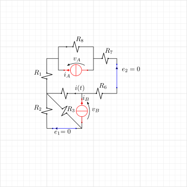

(classical-electromagnetism:electrical-engineering-exercises:transient:1-dynamic)=
# Transient dynamics of linear electrical grids with one dynamic component

```{admonition} Guidelines for solution
:class: dropdown, tip

A many-port Thevenin equivalent circuit of the resistive part of the circuit is found, with two ports for interfacing with the dynamical component (A) and with the switch (B), exploiting PSCE,

$$\begin{aligned}
  v_A & = v_{0,A}(\mathbf{e},\mathbf{a}) + R_{AA} i_A + R_{AB} i_B \\
  v_B & = v_{0,B}(\mathbf{e},\mathbf{a}) + R_{BA} i_A + R_{BB} i_B \\
  i   & =   i_{0}(\mathbf{e},\mathbf{a}) + i_{/i_A} i_A + i_{/i_B} i_B
\end{aligned}$$

The constitutive equation of the dynamical equation is used to evaluate the time evolution of the system, given the initial conditions - usually steady conditions with switches open. If the dynamical element is a capacitor,

$$i_A = - C \dfrac{d v_A}{dt} \ .$$

Typically, (1) the generators provides steady inputs, (2) for $t = 0^{-}$ the switch is open, and closes at $t = 0$. At $t=0$ an impulsive forcing, and thus a jump, in some physical quantity may occur.

**Steady conditions for $t \le 0^-$.** Steady conditions with the switch is open imply
  
   $$\begin{aligned}
       i_B & = 0 && \text{open switch} \\
       i_A & = 0 && \text{steady conditions and $i_A = C \dot{v}_A = 0$} \\
   \end{aligned}$$

**Transient dynamics.** At $t = 0$ the switch closes, so that the tension at the switch immediately goes from the steady value evaluated for $t \le 0^-$ to the value
    
  $$v_B(t) = 0 \qquad , \qquad \text{for $t > 0$} \ ,$$

and thus, its value and its time derivative w.r.t. time, $t \in (-\infty, +\infty)$ can be written as

  $$\begin{aligned}
        v_B  (t) & = v_B(0^-) h(-t) \\
    \dot{v}_B(t) & = - v_B(0^-) \delta(t) \ ,
  \end{aligned}$$

having used the step function $h(t)$ and Dirac's delta $\delta(t)$.

**Method 1. Dynamical equation for the state variable, here $v_A$.** Writing the dynamical equation for the state variable should give a dynamical equation with no impulsive forcing and thus no jump in the physical quantity. Using the equations of the equivalent model, it's possible to write $v_A$ as a function of $i_A$, $v_B$ and the constant tensions $v_{0,A}$, $v_{0,B}$

$$\begin{aligned}
  v_A(t) 
  & = v_{0,A} + R_{AA} i_A + \frac{R_{AB}}{R_{BB}} \left[ v_B(t) - v_{0,B} - R_{BA} i_A  \right] = \\
  & = v_{0,A} - \frac{R_{AB}}{R_{BB}} v_{0,B} + \frac{R_{AB}}{R_{BB}} v_{B}(t) + \left[ R_{AA} - \frac{R_{BA} R_{AB}}{R_{BB}} \right] i_A(t)  = \\
\end{aligned}$$

$$i_A(t) = \frac{R_{BB}}{\text{det} \mathbf{R}} v_A(t) - \frac{R_{BB} v_{0,A} - R_{AB} ( v_{0,B}- v_{B}(t) ) }{\text{det} \mathbf{R}} $$

so that the dynamical equation for $v_A(t)$ reads

$$\begin{aligned}
  0 
  & = C \frac{d v_A}{dt} + i_A = \\
  & = C \frac{d v_A}{dt} + \frac{R_{BB}}{\det \mathbf{R}} v_A(t) - \frac{R_{BB} v_{0,A} - R_{AB} ( v_{0,B}- v_{B}(t) ) }{\det \mathbf{R}} \ ,
\end{aligned}$$

and thus

$$R_{eq} C \frac{d v_A}{dt} + v_A(t) =  v_{0,A} - \frac{R_{AB}}{R_{BB}} ( v_{0,B}- v_{B}(t) )  $$

with $R_{eq} := \dfrac{\det \mathbf{R}}{R_{BB}}$. If $i_A(0^-) = i_B(0^-) = 0$, then

$$\begin{aligned}
  v_{B}(t) & = v_{0,B} h(-t) \\
  v_{0,B} - v_{B}(t) & = v_{0,B} h(t)  \\
\end{aligned}$$

With the initial conditions $v_{A}(0^-) = v_{0,A}$, and defining the difference with the initial steady conditions, $\delta v_A(t) := v_A(t) - v_{0,A}$, $\delta v_B(t) = v_B(t) - v_{0,B}$, the initial condition for the difference reads $\delta v_{A}(0^-) = 0$, so that the Cauchy problem to be solved reads

$$\begin{cases}
  RC \delta \dot{v}_A + \delta v_{A} = \dfrac{R_{AB}}{R_{BB}} \delta v_{B}(t) = - \dfrac{R_{AB}}{R_{BB}} v_{0,B} h(t) \\
  \delta v_A(0^-) = 0 \ .
\end{cases}$$

$$\delta v_A(t) = -\frac{R_{AB}}{R_{BB}} v_{0,B} \, \left[ 1 - \exp\left( - \dfrac{t}{RC} \right) \right] \, h(t) \ .$$

Once the solution $\delta v_A(t)$ is found,

- voltage across the capacitor reads 

   $$\begin{aligned}
     v_A(t)
     & = \delta v_A(t) + v_{A,0} = \\
     & = v_{A,0} - \frac{R_{AB}}{R_{BB}} v_{0,B} \, \left[ 1 - \exp\left( - \dfrac{t}{RC} \right) \right] \, h(t) \ ,
   \end{aligned}$$

- current through the capacitor reads 

   $$\begin{aligned}
     i_A(t) 
     & = C \dfrac{d v_A}{dt}(t) = \\
     & = \frac{R_{AB}}{\det \mathbf{R}} \exp\left( - \dfrac{t}{RC}  \right) \, h(t) \ ,
   \end{aligned}$$

   as $R = \frac{\det \mathbf{R}}{R_{BB}}$;

- current through the switch reads 
   
   $$\begin{aligned}
     i_B(t)
     & = \frac{1}{R_{BB}} \left[ v_B(t) - v_{0,B} - R_{BA} i_A(t) \right] = \\
     & = - \frac{v_{0,B}}{R_{BB}} \, h(t) - \frac{R_{BA} R_{AB}}{R_{BB} \det \mathbf{R} } \exp \left( -\dfrac{t}{RC} \right) \, h(t) \ .
   \end{aligned}$$

- the desired current reads

   $$i(t) = i_0(\mathbf{e}, \mathbf{a}) + i_{/i_A} i_A(t) + i_{/i_B} i_B(t) \ .$$

```

````{exercise} Exam 2025-02-11, Exercise 1.
:label: exam-25-02-11-exe-01

```{figure} ../media/exam-2025-02-11-ese-01.png
```

```{dropdown} Solution
:open:

Following the **guidelines for the solution**, a [many-port Thevenin equivalent circuit](classical-electromagnetism:electrical-engineering:newtork-analysis:thevenin:n-port) of the resistive part of the circuit is found, with two ports for interfacing with the capacitor (A) and with the switch. The dynamical equation of the system is written in state-space representation, writing the voltage at the ports and the unknown variable $i(t)$ as outputs; the capacitor contitutive equation is used to find the time evolution of the system once the switch is closed


```

````

`````{exercise} Exam 2025-01-22, Exercise 1.
:label: exam-25-01-22-exe-01

````{figure} ../media/exam-2025-01-22-ese-01.png
````


````{dropdown} Solution
:open:

Following the **guidelines for the solution**, a [many-port Thevenin equivalent circuit](classical-electromagnetism:electrical-engineering:newtork-analysis:thevenin:n-port) of the resistive part of the circuit is found, with two ports for interfacing with the capacitor (A) and with the switch. The dynamical equation of the system is written in state-space representation, writing the voltage at the ports and the unknown variable $i(t)$ as outputs; the capacitor contitutive equation is used to find the time evolution of the system once the switch is closed

<!--
```{list-table}
:header-rows: 0

* -  

```
-->

```{figure} ../media/exam-2025-01-22-ese-01-b.png
```

```{dropdown} Internal generators on, open circuit

Solution using two loop currents, $i_1$ in the upper part of the circuit and $i_2$ in the lower triangle. Using KVL

$$\begin{aligned}
  0 & = e_2 - (R_7+R_8+R_1+R_4+R_6) i_{2,0} \\
  0 & = e_1 - (R_2+R_3) i_{1,0} \\
\end{aligned}
\quad \rightarrow \quad
\begin{aligned}
  i_{2,0} & = \dfrac{e_2}{R_7+R_8+R_1+R_4+R_6} \\
  i_{1,0} & = \dfrac{e_1}{R_2+R_3} \\
\end{aligned}$$

so that the desired variables read

$$\begin{cases}
  v_{A,0} & = - R_8 i_{2,0} = -\dfrac{R_8}{R_7+R_8+R_1+R_4+R_6} e_2 \\ 
  v_{B,0} & = - R_4 i_{2,0} + R_3 i_{1,0} = - \dfrac{R_4}{R_7+R_8+R_1+R_4+R_6} e_2 + \dfrac{R_3}{R_2+R_3} e_1 \\
  i_{0} & = - i_{2,0} = - \dfrac{e_2}{R_7+R_8+R_1+R_4+R_6} 
\end{cases}$$

$$\begin{cases}
 v_{A,0} & = - 20.69 \, V \\
 v_{B,0} & =  17.91 \, V \\
   i_{0} & = 1.72 \, A \\
\end{cases}$$
```


```{figure} ../media/exam-2025-01-22-ese-01-c.png
```

```{dropdown} Internal generators off, current generators at the ports

Callling $i_A$ and $i_B$ the current passing through the current generators connected at the ports. The solution is found powering one generation at a time and then exploiting PSCE

*Powering A*

$$0 = (i_2 - i_A) R_8 + i_2 (R_1 + R_4 + R_6 + R_7)
\quad \rightarrow \quad
i_2 = \frac{R_8}{R_1 + R_4 + R_6 + R_7 + R_8} i_A
$$

$$\begin{cases}
  v_{A,A} & =   R_8 ( i_2 - i_A ) & = - \dfrac{R_8(R_1+R_4+R_6+R_7)}{R_1 + R_4 + R_6 + R_7 + R_8} i_A \\
  v_{B,A} & = - R_4 i_2 & = - \dfrac{R_4 R_8}{R_1 + R_4 + R_6 + R_7 + R_8} i_A \\
    i_{,A}& = i_2 & = \dfrac{R_8}{R_1 + R_4 + R_6 + R_7 + R_8} i_A \\
\end{cases}$$

$$\begin{cases}
 v_{A,A} & = R_{AA}   \, i_A & =   7.03  \, \Omega \, i_A \\ 
 v_{B,A} & = R_{BA}   \, i_A & = - 1.24  \, \Omega \, i_A \\
   i_{,A} & = i_{/i_A} \, i_A & =   0.414 \, i_A \\
\end{cases}$$

*Powering B.* The equivalent circuit seen by the port $B$ has equivalent resistence

$$R_{eq} = \big( (R_6 + R_7 + R_8 + R_1) \parallel (R_4)  \big) + \big(R_2 \parallel R_3 \big)$$

Currents in the two parallel branches in the upper part of the circuit (current divider) read and the voltages across the generators

$$\begin{aligned}
  i_{2,B} & = \frac{R_4}{R_1+R_4+R_6+R_7+R_8} i_B \\
  i_{3,B} & = \frac{R_2}{R_2+R_3} i_B \\
\end{aligned}$$

$$\begin{cases}
  i_{,B}  & = i_{4,B} & = \dfrac{R_1+R_6+R_7+R_8}{R_1+R_4+R_6+R_7+R_8} i_B \\
  v_{A,B} & = - R_8 i_{2,B} & = - \dfrac{R_4 R_8}{R_1+R_4+R_6+R_7+R_8} i_B  \\
  v_{B,B} & = R_4 i_{4,B} + R_3 i_{3,B} & = \left[ \dfrac{R_4(R_1+R_6+R_7+R_8)}{R_1+R_4+R_6+R_7+R_8} + \dfrac{R_2 R_3}{R_2+R_3} \right] i_B \\
\end{cases}$$

$$\begin{cases}
 v_{A,B} & = R_{AB}   \, i_B & = - 1.24  \, \Omega \, i_B \\ 
 v_{B,B} & = R_{BB}   \, i_B & =   6.81  \, \Omega \, i_B \\
   i_{,B}& = i_{/i_B} \, i_B & =   0.897 \, i_B \\
\end{cases}$$

```

```{figure} ../media/exam-2025-01-22-ese-01-a.png
```

The equations of the equivalent algebraic system are

$$\begin{cases}
 v_A & = v_{A,0} + R_{AA}   \, i_A + R_{AB}   \, i_B \\
 v_B & = v_{B,0} + R_{BA}   \, i_A + R_{BB}   \, i_B \\
 i   & = i_{ ,0} + i_{/i_A} \, i_A + i_{/i_B} \, i_B \\
\end{cases}$$

The constitutive equation of the capacitor reads

$$i_A = C \dfrac{d v_A}{d t} \ .$$

The switch command is off for $t \le 0^-$, on for $t > 0$,

$$i_B(t \le 0^{-}) = 0 \qquad , \qquad v_B (t \ge 0^+) = 0 \ .$$

**Steady solution for $t \le 0^-$.** With switch open $i_B = 0$ and steady conditions $i_A = C \dot{v}_A = 0$,

$$\begin{cases}
  v_A(0^-) & = v_{A,0} & =       - 20.69 \, V \\
  v_B(0^-) & = v_{B,0} & = \ \ \   17.91 \, V \\
    i(0^-) & = i_{ ,0} & = \quad \  1.72 \, A \\
\end{cases}$$

**Transient dynamics**, when the switch closes

$$\mathbf{R} = \begin{bmatrix} R_{AA} & R_{AB} \\ R_{BA} & R_{BB} \end{bmatrix} = \begin{bmatrix} 7.03 & -1.24 \\ -1.24 & 6.81 \end{bmatrix} \, \Omega$$

$$R_{eq} = \frac{\det \mathbf{R}}{R_{BB}} = \frac{46.34 \, \Omega^2}{ 6.81 \, \Omega} = 6.80 \, \Omega \ .$$

$$\tau = R_{eq} C = 6.8 \, \Omega \cdot 5 \cdot 10^{-4} \, F = 3.4 \cdot 10^{-3} \, s \ . $$

- **Tension across the switch**

   $$\begin{aligned}
     v_{B}(t) & = v_{B,0} \, h(-t) \\
     v_{B}(t) - v_{B,0} & = v_{B,0} \, h(t) \ . 
   \end{aligned}$$

- **Tension across the capacitor.** The dynamical equation for the difference of the state variable reads

   $$\begin{cases}
     R_{eq} C \delta \dot{v}_A + \delta v_{A} = \dfrac{R_{AB}}{R_{BB}} \delta v_{B}(t) = - \dfrac{R_{AB}}{R_{BB}} v_{0,B} \, h(t) \\
     \delta v_A(0^-) = 0 \ .
   \end{cases}$$
   
   $$\begin{aligned}
     \delta v_A(t)
     & = -\frac{R_{AB}}{R_{BB}} v_{0,B} \, \left[ 1 - \exp\left( - \dfrac{t}{RC} \right) \right] \, h(t) = \\
     & = \frac{1.24}{6.81} \, 17.91 \, V \, \left[ 1 - \exp\left( - \dfrac{t}{\tau} \right) \right] \, h(t) = \\
     & = 3.26 \, V \, \left[ 1 - \exp\left( - \dfrac{t}{\tau} \right) \right] \, h(t) = \\
     & = \Delta V \, \left[ 1 - \exp\left( - \dfrac{t}{\tau} \right) \right] \, h(t) \ .
   \end{aligned}$$
   
   $$\begin{aligned}
     v_A(t) 
     & = v_{A,0} + \delta v_A(t) = \\
     & = v_{A,0} + \Delta V \, \left[ 1 - \exp\left( - \dfrac{t}{\tau} \right) \right] \, h(t) \ , 
   \end{aligned}$$

   so that the values

   $$\begin{aligned} 
     v_A(0^+) & = v_{A,0}  && = -20.69 \, V \\
     v_A(+\infty) & = v_{A,0} + \Delta V = -20.69 \, V + 3.26 \, V && = -17.43 \, V
   \end{aligned}$$

- **Current through the capacitor.**

   $$\begin{aligned}
     i_A(t)
     & = C \dfrac{d v_A}{d t}(t) = \\
     & = \frac{\Delta V}{R_{eq}} \exp \left( - \frac{t}{\tau} \right) \, h(t) = \\
     & = I_A \, \exp \left( - \frac{t}{\tau} \right) \, h(t) \ , 
   \end{aligned}$$

   so that the values 

   $$\begin{aligned}
     i_A(0^+) & = I_{A} && = 0.48 \, A \\
     i_A(+\infty) &     && = 0 \, A
   \end{aligned}$$

- **Current across the switch**

   $$\begin{aligned}
     i_B(t) 
     & = \frac{1}{R_{BB}} \bigg[ v_B(t) - v_{B,0} - R_{BA} i_A(t) \bigg] = \\
     & = \left[ \frac{v_{B,0}}{R_{BB}} - \frac{R_{BA}}{R_{BB}} I_A \, \exp \left( - \frac{t}{\tau} \right) \right] \, h(t) \ . 
   \end{aligned}$$

   so that the values

   $$\begin{aligned}
     i_B(0^+) & = \frac{v_{B,0}}{R_{BB}} - \frac{R_{BA}}{R_{BB}} I_A =  \frac{17.91 \, V}{6.81 \, \Omega} - \frac{-1.24}{6.81} \, 0.48 \, A  && = 2.72 \, A  \\
     i_B(+\infty) & = \frac{v_{B,0}}{R_{BB}} = \frac{17.91 \, V}{6.81 \, \Omega} && = 2.63 \, A
   \end{aligned}$$

- **Current $i(t)$**

   $$\begin{aligned}
     i(t) 
     & = i_{,0} + i_{/i_A} \, i_A(t) + i_{/i_B} \, i_B(t) = \\
     & = i_{,0} + \left\{ i_{/i_A} \, I_A \, \exp \left( - \frac{t}{\tau} \right) + i_{/i_B} \left[ \frac{v_{B,0}}{R_{BB}} - \frac{R_{BA}}{R_{BB}} I_A \, \exp \left( - \frac{t}{\tau} \right) \right] \right\} \, h(t) = \\
     & = i_{,0} + i_{/i_B} \frac{v_{B,0}}{R_{BB}} h(t) + \left( i_{/i_A} - i_{/i_B} \frac{R_{BA}}{R_{BB}} \right) \, I_A \, \exp \left( - \frac{t}{\tau} \right) \, h(t) \ .
   \end{aligned}$$

   so that the values

   $$\begin{aligned}
     i(0^+)     & =  i_{,0}    + i_{/i_A} \, i_A(0^+    ) + i_{/i_B} \, i_B(0^+    )  = \\
                & =  1.72 \, A + 0.414    \, i_A(0^+    ) + 0.897    \, i_B(0^+    )  = \\
                & =  1.72 \, A + 0.20 \, A + 2.44 \, A = \\ \\
     i(+\infty) & =  i_{,0}    + i_{/i_A} \, i_A(+\infty) + i_{/i_B} \, i_B(+\infty)  = \\
                & =  1.72 \, A + 0.414    \, i_A(+\infty) + 0.897    \, i_B(+\infty)  = \\
                & =  1.72 \, A + 0.0 \, A + 2.36 \, A = \\
   \end{aligned}$$

**Energy stored in the capacitor.**

$$E_C(t) = \frac{1}{2} C v_A^2(t) \ ,$$

and for $t = \tau$, $v_A(\tau) = -18.63 \, V$

$$E_C(\tau) = 0.5 \cdot 5 \cdot 10^{-4} \, F \cdot ( 18.63 \, V )^2 = 8.68 \cdot 10^{-2} \, J$$

````

`````


````{exercise} Exam 2024-09-06, Exercise 1.
:label: exam-24-09-06-exe-01

```{figure} ../media/exam-2024-09-06-ese-01.png
```

````
